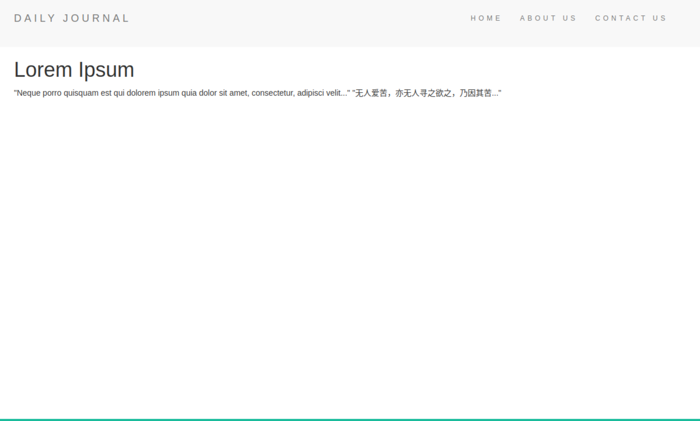

# Blog Site  Node.JS   MongoDB Atlas

This app runs on Node.JS and use EJS for dynamic rendering. Data are stored on MongoDB Atlas.
Note: for security purpose, MongoDB ***connection credential*** is replaced with***`<-admin-user>` and `<passwoed>`***
